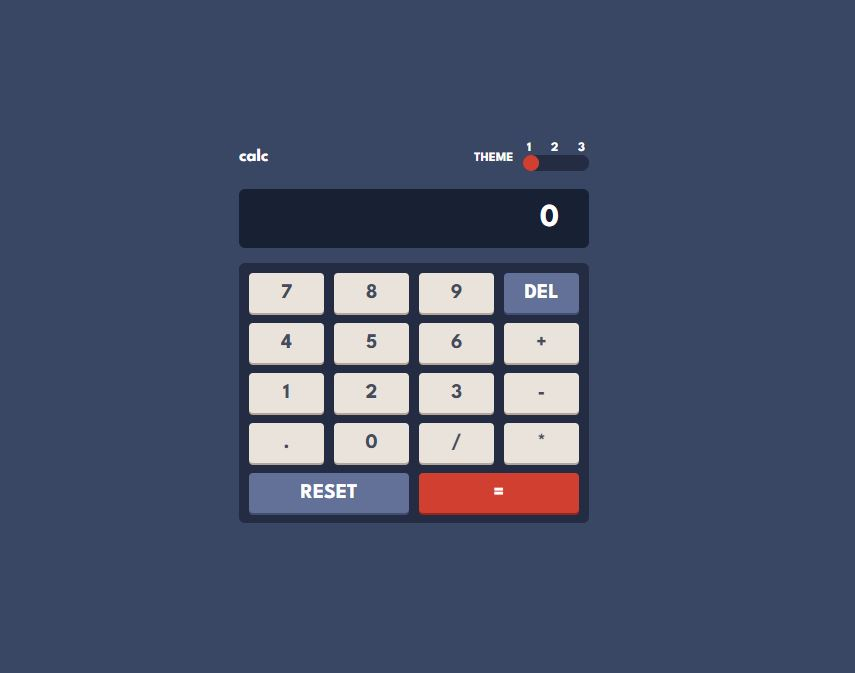

# Frontend Mentor - Calculator app solution

This is a solution to the [Calculator app challenge on Frontend Mentor](https://www.frontendmentor.io/challenges/calculator-app-9lteq5N29).

## Table of contents

- [Overview](#overview)
  - [The challenge](#the-challenge)
  - [Screenshot](#screenshot)
  - [Links](#links)
- [My process](#my-process)
  - [Built with](#built-with)
  - [What I learned](#what-i-learned)
  - [Continued development](#continued-development)
  - [Useful resources](#useful-resources)
- [Author](#author)

## Overview

### The challenge

Users should be able to:

- See the size of the elements adjust based on their device's screen size
- Perform mathmatical operations like addition, subtraction, multiplication, and division
- Adjust the color theme based on their preference
- **Bonus**: Have their initial theme preference checked using `prefers-color-scheme` and have any additional changes saved in the browser

### Screenshot

### Links

- [GitHub Repo](https://github.com/mikhailkollen/Calculator-Project)
- [Live Site URL](https://mikhailkollen.github.io/Calculator-Project/)

## My process

### Built with

- Semantic HTML5 markup
- CSS custom properties
- Flexbox
- CSS Grid
- Sass

### What I learned

During the project I tried using Sass for the first time. I found it helpful when working with more complex designs. I also applied skills of Flexbox and Grid, which helped me polish some of the uncertainties that I encountered during my previous projects.
It was also my first time using LocalStorage in a personal project and I would like to work with it more in the future.

### Continued development

I want to use Sass more, but instead of using an extension to compile it, I would prefer using a different tool, as in my case it stopped watching the changes at some moment.
I would also like to focus on modular approach more, as it surely helps with organizing code, thus speeds up development.

### Useful resources

- [Traversy Media's Youtube video on Sass](https://www.youtube.com/watch?v=nu5mdN2JIwM&t=2484s)

## Author

- [GitHub](https://github.com/mikhailkollen)
- Frontend Mentor - [@mikhailkollen](https://www.frontendmentor.io/profile/mikhailkollen)
